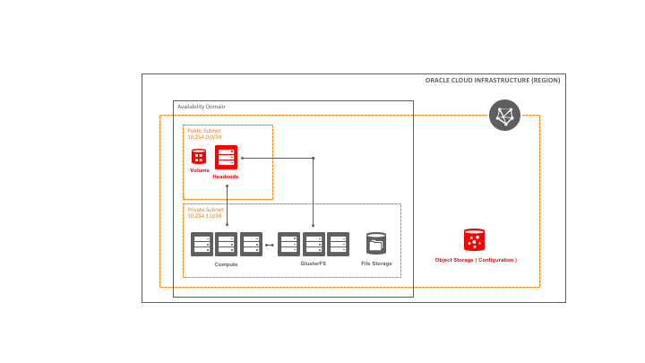

# hpc-quickstart

<pre>
      `-/+++++++++++++++++/-.`
   `/syyyyyyyyyyyyyyyyyyyyyyys/.
  :yyyyo/-...............-/oyyyy/
 /yyys-                     .oyyy+
.yyyy`                       `syyy-
:yyyo                         /yyy/ Oracle Cloud HPC Cluster Demo
.yyyy`                       `syyy- https://github.com/oracle/hpc-quickstart
 /yyys.                     .oyyyo
  /yyyyo:-...............-:oyyyy/`
   `/syyyyyyyyyyyyyyyyyyyyyyys+.
     `.:/+ooooooooooooooo+/:.`
`
</pre>

High Performance Computing and storage in the cloud can be very confusing and it can be difficult to determine where to start. This repository is designed to be a first step in expoloring a cloud based HPC storage and compute architecture. There are many different configurations and deployment methods that could be used, but this repository focuses on a bare metal compute system deployed with Terraform. After deployment fully independant and functioning IaaS HPC compute cluster has been deployed based on the architecture below.

This deployment is an example of cluster provisioning using Terraform and SaltStack. Terraform is used to provision infrastructure, while Salt is a configuration and cluster management system. 

Salt configuration is stored under ./salt directory, containing pillar/ (variables) and salt/ (state) information. Read more about salt in the documentation: https://docs.saltstack.com/en/latest/

## Architecture

## Authentication
terraform.tvars contain required authentication variables

## Operations
Salt commands should be executed from the headnode. 
IntelMPI installation: sudo salt '*' state.apply intelmpi

## SSH Key
SSH key is generated each time for the environment in the ./key.pem file. 

## Networking 
* Public subnet - Headnode acts a jump host and it's placed in the public subnet. The subnet is open to SSH connections from everywhere. Other ports are closed and can be opened using custom-security-list in the OCI console/cli.  All connections from VCN are accepted. Host firewall service is disabled by default. 
* Private subnet - All connections from VCN are accepted. Public IP's are prohibited in the subnet. Internet access is provided by NAT gateway. 
  
## Roles
Roles are set in variables.tf as additional_headnode_roles, additional_worker_roles, additional_storage_roles or additional_role_all Additional roles provide ability to install and configure applications defined as Salt states. 

Example roles:
* intelmpi: provides configured Intel yum repository and installs IntelMPI distribution
* openmpi: installs OpenMPI from OL repository

## Storage
* Storage node require to be DenseIO shape (NVME devices are detected and configured).

### Filesystems

Storage role servers will be configured as filesystem nodes, while headnode and worker nodes will act as a clients. 
* GlusterFS (requires storage role) - To use GlusterFS set storage_type to glusterfs.  Filesystem will be greated as :/gfs and mounted under /mnt/gluster
* BeeGFS (requires storage role) - To use BeeGFS set storage_type to beegfs.  Filesystem will be mounted under /mnt/beegfs

### NFS
* Block volumes - Each node type can be configured with block volumes in the variables.tf
  Headnode will export first block volume as NFS share under /mnt/share (configured in salt/salt/nfs.sls)
  Other block volume attachments need to be configured manually after cluster provisioning. 

* FSS - File system service endpoint will be created in the private subnet and mounted on each node under /mnt/fss
