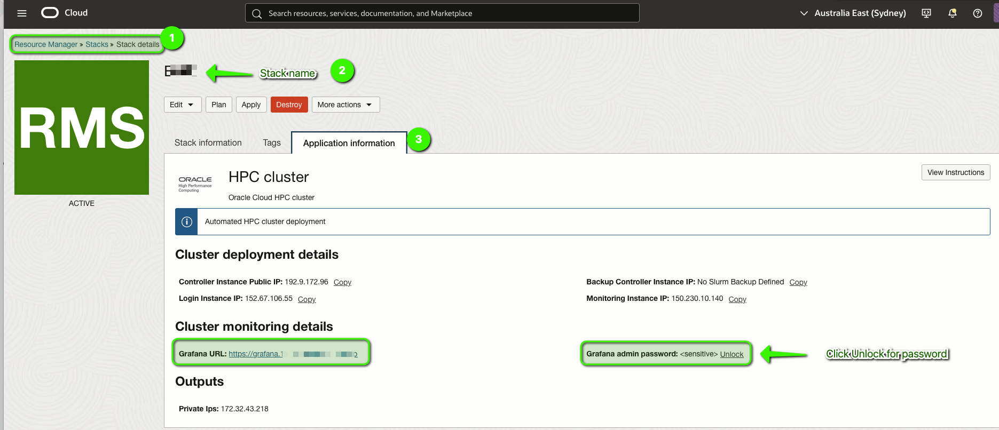
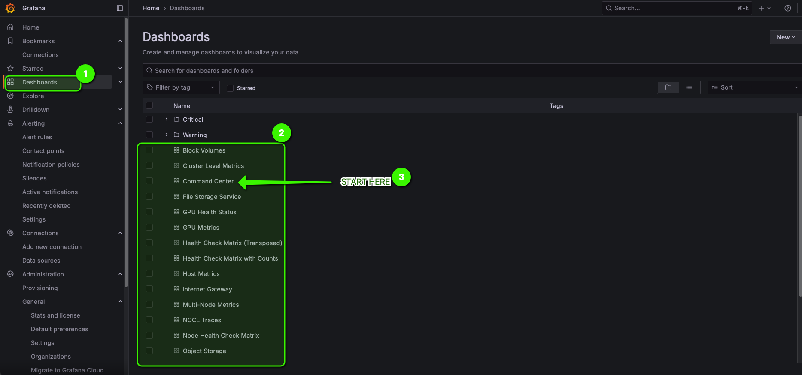
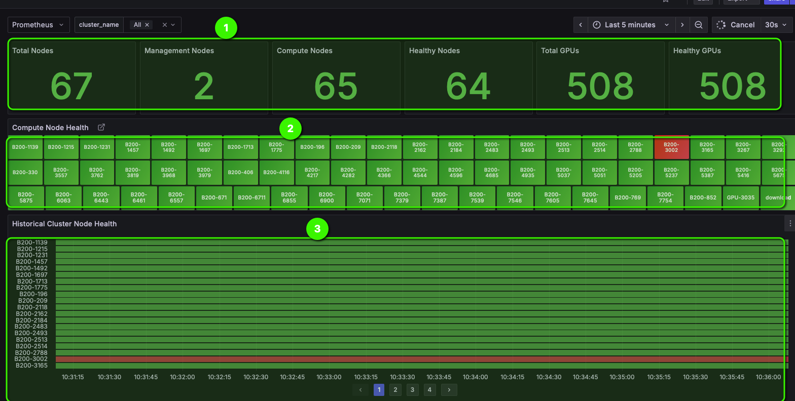
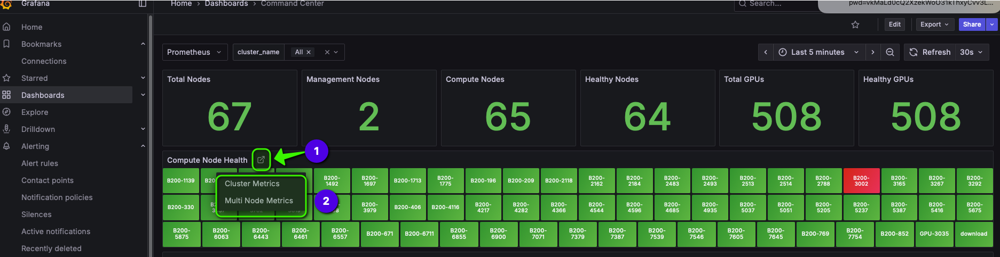
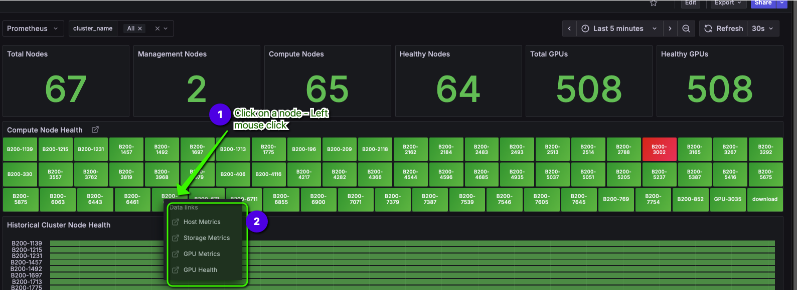
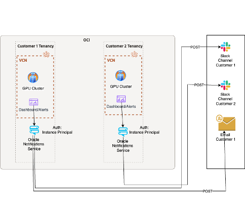
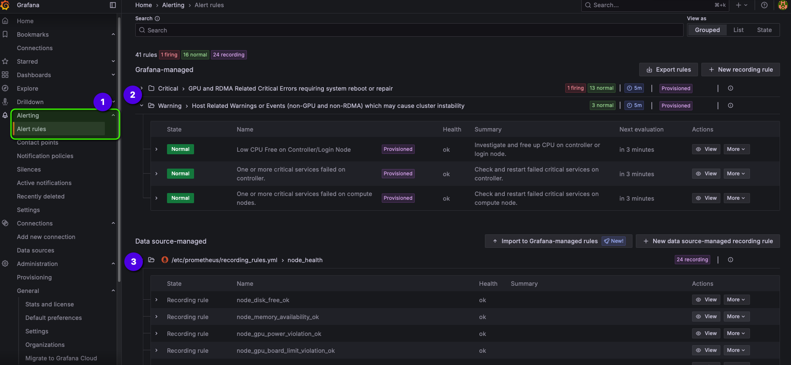
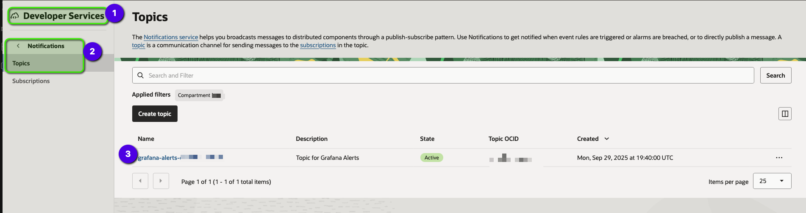
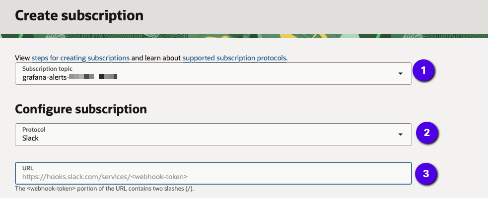
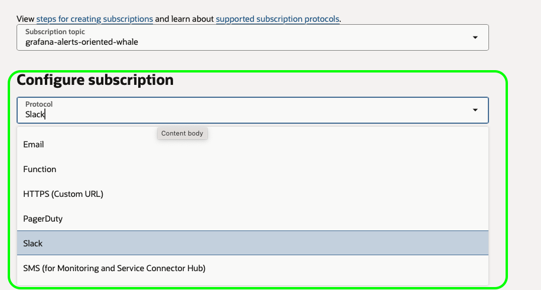

# Monitoring and alerting

The following is the documentation for Monitoring components deployed as part of our Slurm HPC stack. This guide is divided into three parts: Deployment, User Guide, and Operations. Deployment covers the stack configuration and specific deployment notes such as ports used by exporters. The User Guide walks you through dashboards and alerts, and the Operations section covers maintenance activities, tips, and other operational details. 

## Deployment

### Architecture

The monitoring stack deployed as part of the HPC deployment primarily consists of three components:
- Grafana instance that hosts pre-built, ready-to-use dashboards and pre-provisioned alert rules.
- Prometheus instance that scrapes metrics from exporters running on nodes and includes recording rules for aggregations used to calculate health.
- Exporters that run on individual instances. 


### Stack Configuration

During stack deployment via Resource Manager, the "Cluster Monitoring" section provides several options for installing and configuring monitoring.

Ideally you should enable all options for a standard deployment, but these can be customized as needed.

**Install HPC Cluster Monitoring Tools** — check this flag (blue check mark) to install Prometheus, Grafana (on the controller/monitoring node), and metrics exporters (compute nodes). Installation is automatic. When you check the above flag, the following additional configuration options appear:

**Use Let's Encrypt Production Endpoint** — check this flag to enable SSL for the Grafana dashboard using a custom URL in the format `"https://grafana.PUBLIC-IP.endpoint.oci-hpc.ai"`; this URL will be shown in the stack output and logs. See the section below for how to obtain the Grafana URL and admin password after stack creation.

**Install HPC Cluster alerting tools** — check this flag to create an OCI Notifications Topic and a webhook that runs on the controller/monitoring node as part of the stack deployment. See the section below on configuring a Slack subscription to send alerts to a Slack channel.

**Ingest OCI metrics in Prometheus** — check this flag to include OCI service metrics in Prometheus. We provide pre-built dashboards for these metrics so you can view cluster and OCI service metrics in a single Grafana instance, avoiding the need to log in to the OCI Console to view metrics or build custom dashboards there. 

**Monitoring Node** — by default, if this option is not checked, monitoring is installed on the controller node. If you have left the controller node at its default size, hosting Prometheus, Grafana, and Slurm on the same node requires additional resources. If you do not use a separate monitoring node, ensure the controller node has sufficient CPU and memory. If you check this option, you can install Prometheus and Grafana on a separate node by specifying options such as **shape of the monitoring node, availability zone, number of cores, custom memory size, and boot volume size**. 

Suggested monitoring node sizes

| Cluster size | OCPU | Memory | Boot volume size |
| --- | ---: | ---: | ---: |
| < 16 compute nodes | 8 | 64 GB | 256 GB 
| 16 - 32 compute nodes | 16 | 128 GB | 256 GB 
| 32 - 64 compute nodes | 32 | 256 GB | 512 GB 
| 64 - 128 compute nodes | 32 | 512 GB | 1024 GB 
| > 128 compute nodes | 64 | 512 GB | 1024 GB 


### Monitoring Configuration

Monitoring installs and configures Prometheus, Grafana, and exporters on specific ports. The following table lists ports, components, and their usage:

| Port | Systemd Service Name | Where it runs | What it does |
| --- | --- | --- | --- |
| 3000 or 443 | grafana-server | Grafana | Dashboards |
| 5000 | ons-webhook | Grafana Webhook for OCI Notifications | Deliver alerts via Slack, Email etc. |
| 9090 | prometheus | monitoring or controller | Exposes Prometheus metrics for scraping |
| 9100 | node-exporter and customMetrics | compute, login and controller | Node metrics and custom health check metrics |
| 9273 | telegraf | controller | Metrics for OCI Services via telegraf |
| 9300 | oci-rdma-faults-exporter | controller | RDMA Faults as seen by OCA |
| 9400 | dcgm-exporter (NVIDIA) or amd-device-metrics-exporter (AMD) | compute | GPU metrics |
| 9500 | rdma-exporter | compute | RDMA metrics |
| 9600 | nvlink-exporter | compute | NVLink metrics |
| 9700 | pcie-faults-exporter.service | compute | PCIe AER stats and faults detector for GPU, NVME and RDMA |
| 9800 | nvml-exporter (NVIDIA GPU and CPU, AMD CPU)  | compute | Slurm job accounting for GPU and CPU |
| 9900 | slurm-exporter  | controller | Slurm metrics |

Additional notes:
> nvml-exporter was originally designed for NVIDIA GPUs. When deployed, our Ansible script enables GPU accounting mode. While a Slurm job is running, the exporter captures the Slurm Job ID for each process ID (pid) on a node and tracks GPU and CPU compute and memory utilization per job. This helps track job performance across nodes and can be used for FinOps applications. On AMD GPUs, the same exporter only emits CPU compute and memory utilization; on AMD nodes, AMD-provided prolog/epilog scripts inject the job-id tag into the amd-device-metrics-exporter.

## User Guide

### Access

To access the Grafana dashboard in the OCI Console, navigate to Resource Manager -> Stacks and select the stack name. On the right-hand side, open the 'Application Information' tab and locate 'Cluster Monitoring Details'; there you will find the Grafana dashboard URL and password. Click the 'Unlock' link next to the hidden password to reveal it. The default Grafana username is `admin`.



### Dashboards

Once you log in to Grafana, open 'Dashboards' from the left-hand menu to see the list of pre-built dashboards included with the deployment. Always start with the **Command Center** dashboard, which has context-sensitive links to open other dashboards.



### Command Center

The command center is where you get a quick view of **cluster health** to determine what to focus on. It consists of three panels:
1. Node and GPU count panel — shows available nodes and GPUs and their health.
2. Health of individual nodes.
3. Historical node health.

> Keep in mind that this dashboard shows node health; it does not indicate GPU availability for scheduling jobs.



### Context Menus

There are two sets of context-sensitive dashboards:
- Cluster 
    - Cluster Level Metrics
    - Multi Node Metrics
- Host/Node
    - Host Metrics
    - Storage Metrics
    - GPU Metrics
    - GPU Health

You can access these menus as shown in the screenshots below.

Cluster Context:


Node Context:


### Alerts



The monitoring stack includes pre-built alerts with pre-configured thresholds based on our experience supporting customer clusters. You can add, modify, or remove alerts as needed.

We include several Prometheus recording rules to calculate health scores for GPU nodes.

See screenshots below.


### Subscriptions 

By default, alerts can be delivered to Oracle internal Slack channels. For customer support, we maintain customer-specific Slack channels where engineers provide follow-the-sun monitoring and response.

To set up a subscription for alerts, locate the alert's OCI Notification Service topic as shown below, then click 'Subscriptions' and 'Create Subscription'. See the example below for adding a Slack webhook to a subscription.

Alert Topic:


Topic Subscription:


In addition to Slack, we support several other subscription delivery methods:



## Operations

### Systemd 

Exporters, Prometheus, and Grafana are all systemd services. You can view their status or start and stop them by running the following commands. You can find the service names in the **Monitoring Configuration** section.

```bash
sudo systemctl status <service-name>
sudo systemctl restart <service-name>
sudo systemctl stop <service-name>

```

### Alert Rules

If you would like to modify alert rules, SSH into the monitoring node. You will find `alert-rules.yaml` and `delete-rules.yaml` in `/etc/grafana/provisioning/alerting`. Modify thresholds in `alert-rules.yaml` as needed. If you do not want to receive an alert, configure it in `delete-rules.yaml`. Do not delete alert rules from `alert-rules.yaml`. Once alert rules are provisioned, Grafana expects CRUD operations to add or delete alerts.

### Recording Rules

Prometheus recording rules can be found in `/etc/prometheus/recording_rules.yml`. You can add or modify recording rules as needed. Do not delete existing recording rules, as many dashboards and alerts depend on them.


