# Monitoring and alerting

The following is the documentation for Monitoring components deployed as part of our Slurm HPC stack. This guide is divided into three parts: Deployment, User Guide, and Operations. Deployment covers the stack configuration and specific deployment notes such as ports used by exporters. The User Guide walks you through dashboards and alerts, and the Operations section covers maintenance activities, tips, and other operational details. 

## Deployment

### Architecture

The monitoring stack deployed as part of the HPC deployment primarily consists of three components:
- Grafana instance that hosts pre-built, ready-to-use dashboards and pre-provisioned alert rules.
- Prometheus instance that scrapes metrics from exporters running on nodes and includes recording rules for aggregations used to calculate health.
- Exporters that run on individual instances. 


### Stack Configuration

During stack deployment via Resource Manager, the "Cluster Monitoring" section provides several options for installing and configuring monitoring.

Ideally you should enable all options for a standard deployment, but these can be customized as needed.

**Install HPC Cluster Monitoring Tools** — check this flag (blue check mark) to install Prometheus, Grafana (on the controller/monitoring node), and metrics exporters (compute nodes). Installation is automatic.

**Enable Slurm job monitoring** — check this flag to enable Slurm-specific monitoring. This installs the Slurm REST exporter, the DB-backed Slurm job exporter, Slurm dashboards, and compute-node job/GPU utilization writes from the NVML exporter. Leave it unchecked when you only need base system, node, GPU, storage, network, and OCI monitoring.

**Slurm monitoring MySQL backend** — choose where Slurm job monitoring stores job accounting and utilization data. This option appears only when Slurm job monitoring is enabled. Choose **local** to use the controller-local MySQL service. This is useful for testing, proof of concept deployments, and small clusters because it does not create an OCI managed MySQL DB System only for monitoring. Choose **managed** to use an OCI managed MySQL DB System. Managed is the default and is recommended for larger or production deployments. If you choose managed, configure the shared DB System in **Database Options** by selecting the MySQL shape and setting the MySQL administrator username and password. When Slurm HA is enabled, Slurm job monitoring reuses the same managed MySQL instance with a separate monitoring database and users.

Slurm and monitoring database deployment options:

| Slurm job monitoring | Slurm HA | Monitoring backend selection | Effective database deployment | Database Options required | Result |
| --- | --- | --- | --- | --- | --- |
| Disabled | Disabled | Hidden and unused | No monitoring database is created | No | Base cluster monitoring only; Slurm job exporters and job dashboards are not installed. |
| Enabled | Disabled | **local** | MySQL on the controller | No | Ansible creates `slurm_jobs`, its tables, and monitoring users in the controller-local MySQL service. |
| Enabled | Disabled | **managed** | OCI managed MySQL DB System | Yes | Terraform creates the managed DB System and Ansible creates `slurm_jobs`, its tables, and monitoring users on it. |
| Disabled | Enabled | Hidden and unused | OCI managed MySQL DB System for Slurm HA | Yes | Slurm HA uses managed MySQL for Slurm accounting; the `slurm_jobs` monitoring database and job exporters are not created. |
| Enabled | Enabled | Hidden; automatically forced to **managed** | One shared OCI managed MySQL DB System | Yes | Slurm HA accounting and monitoring reuse the same DB System but use separate databases and credentials. Ansible creates `slurm_jobs`, its tables, and monitoring users. |

The **local** monitoring backend is not available when Slurm HA is enabled. The local/managed selector is hidden in Resource Manager for HA deployments, and Terraform makes `managed` the effective backend for deployments performed outside the schema UI as well.

When Slurm job monitoring is enabled, Ansible creates the `slurm_jobs` monitoring database, required tables and indexes, and two generated monitoring users. The `slurm_exporter` user is granted `SELECT`, `INSERT`, `UPDATE`, `DELETE`, `CREATE`, `ALTER`, and `INDEX` on `slurm_jobs.*`. The `slurm_grafana` user is granted `SELECT` on `slurm_jobs.*`.

#### Slurm job monitoring data flow

The monitoring MySQL participant below represents either controller-local MySQL or the OCI managed MySQL DB System selected by the deployment options above.

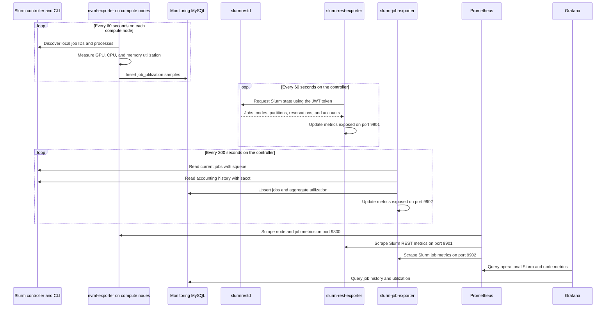
```mermaid
sequenceDiagram
    participant Slurm as Slurm controller and CLI
    participant NVML as nvml-exporter on compute nodes
    participant DB as Monitoring MySQL
    participant RESTD as slurmrestd
    participant REST as slurm-rest-exporter
    participant Job as slurm-job-exporter
    participant Prom as Prometheus
    participant Grafana as Grafana

    loop Every 60 seconds on each compute node
        NVML->>Slurm: Discover local job IDs and processes
        NVML->>NVML: Measure GPU, CPU, and memory utilization
        NVML->>DB: Insert job_utilization samples
    end

    loop Every 60 seconds on the controller
        REST->>RESTD: Request Slurm state using the JWT token
        RESTD-->>REST: Jobs, nodes, partitions, reservations, and accounts
        REST->>REST: Update metrics exposed on port 9901
    end

    loop Every 300 seconds on the controller
        Job->>Slurm: Read current jobs with squeue
        Job->>Slurm: Read accounting history with sacct
        Job->>DB: Upsert jobs and aggregate utilization
        Job->>Job: Update metrics exposed on port 9902
    end

    Prom->>NVML: Scrape node and job metrics on port 9800
    Prom->>REST: Scrape Slurm REST metrics on port 9901
    Prom->>Job: Scrape Slurm job metrics on port 9902
    Grafana->>Prom: Query operational Slurm and node metrics
    Grafana->>DB: Query job history and utilization
```

**Enable LDAP for Grafana UI** — check this flag if you want Grafana to authenticate users against the cluster LDAP directory during deployment. This option is shown only when both cluster monitoring and cluster LDAP are enabled. If left unchecked, Grafana continues to use local Grafana users only. If you later want to disable Grafana LDAP on an existing cluster, use `scripts/disable_grafana_ldap.py` on the Grafana host rather than editing the stack.

**Use Let's Encrypt Production Endpoint** — check this flag to enable SSL for the Grafana dashboard using a custom URL in the format `"https://grafana.PUBLIC-IP.endpoint.oci-hpc.ai"`; this URL will be shown in the stack output and logs. See the section below for how to obtain the Grafana URL and admin password after stack creation.

**Install HPC Cluster alerting tools** — check this flag to create an OCI Notifications Topic and a webhook that runs on the controller/monitoring node as part of the stack deployment. See the section below on configuring a Slack subscription to send alerts to a Slack channel.

**Ingest OCI metrics in Prometheus** — check this flag to include OCI service metrics in Prometheus. We provide pre-built dashboards for these metrics so you can view cluster and OCI service metrics in a single Grafana instance, avoiding the need to log in to the OCI Console to view metrics or build custom dashboards there. 

**Monitoring Node** — by default, if this option is not checked, monitoring is installed on the controller node. If you have left the controller node at its default size, hosting Prometheus, Grafana, and Slurm on the same node requires additional resources. If you do not use a separate monitoring node, ensure the controller node has sufficient CPU and memory. If you check this option, you can install Prometheus and Grafana on a separate node by specifying options such as **shape of the monitoring node, availability zone, number of cores, custom memory size, and boot volume size**. 

Suggested monitoring node sizes

| Cluster size | OCPU | Memory | Boot volume size |
| --- | ---: | ---: | ---: |
| < 16 compute nodes | 8 | 64 GB | 256 GB 
| 16 - 32 compute nodes | 16 | 128 GB | 256 GB 
| 32 - 64 compute nodes | 32 | 256 GB | 512 GB 
| 64 - 128 compute nodes | 32 | 512 GB | 1024 GB 
| > 128 compute nodes | 64 | 512 GB | 1024 GB 


### Monitoring Configuration

Monitoring installs and configures Prometheus, Grafana, and exporters on specific ports. The following table lists ports, components, and their usage:

| Port | Systemd Service Name | Where it runs | What it does |
| --- | --- | --- | --- |
| 3000 or 443 | grafana-server | Grafana | Dashboards |
| 5000 | ons-webhook | Grafana Webhook for OCI Notifications | Deliver alerts via Slack, Email etc. |
| 6820 | slurmrestd | controller | Slurm REST API used by the Slurm REST exporter |
| 9090 | prometheus | monitoring or controller | Exposes Prometheus metrics for scraping |
| 9100 | node-exporter and customMetrics | compute, login and controller | Node metrics and custom health check metrics |
| 9273 | telegraf | controller | Metrics for OCI Services via telegraf |
| 9300 | oci-rdma-faults-exporter | controller | RDMA Faults as seen by OCA |
| 9400 | dcgm-exporter (NVIDIA) or amd-device-metrics-exporter (AMD) | compute | GPU metrics |
| 9500 | rdma-exporter | compute | RDMA metrics |
| 9600 | nvlink-exporter | compute | NVLink metrics |
| 9700 | pcie-faults-exporter.service | compute | PCIe AER stats and faults detector for GPU, NVME and RDMA |
| 9718 | lustre-utilization-exporter | controller | MDT, OST, and total Lustre capacity metrics; installed only when Lustre is enabled |
| 9800 | nvml-exporter (NVIDIA GPU and CPU, AMD CPU)  | compute | Node-level GPU/CPU metrics; optionally writes Slurm job utilization samples when Slurm job monitoring is enabled |
| 9900 | slurm-exporter | controller | Legacy Slurm metrics endpoint |
| 9901 | slurm-rest-exporter | controller | Optional Slurm jobs, nodes, partitions, reservations, and account metrics from `slurmrestd` when Slurm job monitoring is enabled |
| 9902 | slurm-job-exporter | controller | Optional Slurm job accounting metrics enriched with utilization from the monitoring database when Slurm job monitoring is enabled |

Additional notes:
> nvml-exporter was originally designed for NVIDIA GPUs. When deployed, our Ansible script enables GPU accounting mode. While a Slurm job is running, the exporter captures the Slurm Job ID for each process ID (pid) on a node and tracks GPU and CPU compute and memory utilization per job. This helps track job performance across nodes and can be used for FinOps applications. On AMD GPUs, the same exporter only emits CPU compute and memory utilization; on AMD nodes, AMD-provided prolog/epilog scripts inject the job-id tag into the amd-device-metrics-exporter.

## User Guide

### Access

To access the Grafana dashboard in the OCI Console, navigate to Resource Manager -> Stacks and select the stack name. On the right-hand side, open the 'Application Information' tab and locate 'Cluster Monitoring Details'; there you will find the Grafana dashboard URL and password. Click the 'Unlock' link next to the hidden password to reveal it. The default Grafana username is `admin`.

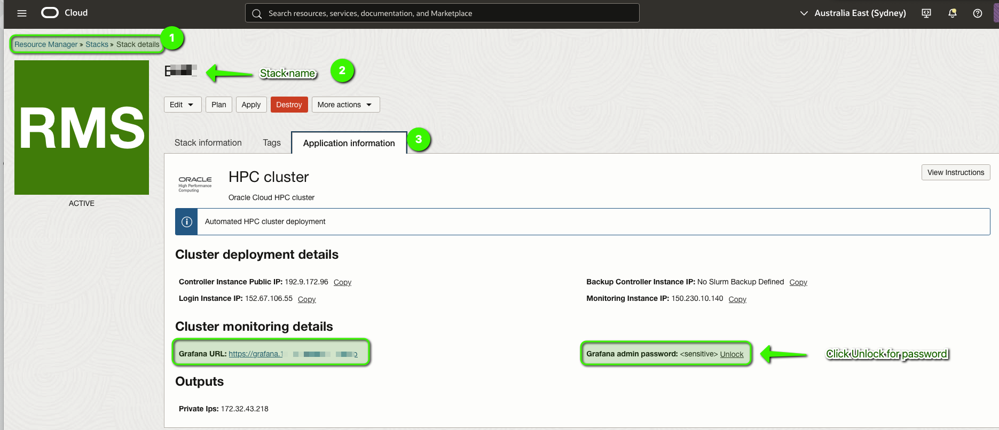

When both cluster LDAP and **Enable LDAP for Grafana UI** are enabled during stack deployment, Grafana also accepts the same LDAP username and password used on the controller. If the Grafana LDAP option is left unchecked, Grafana uses local Grafana users only. Local Grafana `admin` access remains available as a break-glass account. To disable Grafana LDAP later on an already deployed cluster, run `scripts/disable_grafana_ldap.py` on the Grafana host.

Grafana role mapping is driven by LDAP group membership:

| LDAP Group DN | Grafana Role |
| --- | --- |
| `cn=grafana-admins,ou=Group,dc=local` | Admin |
| `cn=grafana-editors,ou=Group,dc=local` | Editor |
| any other authenticated LDAP user | Viewer |

You can create and manage the LDAP groups from the controller:

```bash
sudo cluster group create grafana-admins
sudo cluster group create grafana-editors
sudo cluster group add grafana-admins alice
sudo cluster group add grafana-editors bob
```

Grafana creates the user record automatically on first successful LDAP login.

### Dashboards

Once you log in to Grafana, open 'Dashboards' from the left-hand menu to see the list of pre-built dashboards included with the deployment. Always start with the **Command Center** dashboard, which has context-sensitive links to open other dashboards.

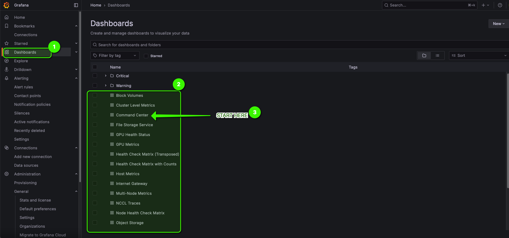

### Command Center

The command center is where you get a quick view of **cluster health** to determine what to focus on. It consists of three panels:
1. Node and GPU count panel — shows available nodes and GPUs and their health.
2. Health of individual nodes.
3. Historical node health.

> Keep in mind that this dashboard shows node health; it does not indicate GPU availability for scheduling jobs.

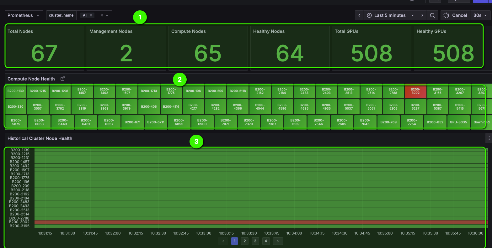

### Context Menus

There are two sets of context-sensitive dashboards:
- Cluster 
    - Cluster Level Metrics
    - Multi Node Metrics
- Host/Node
    - Host Metrics
    - Storage Metrics
    - GPU Metrics
    - GPU Health

You can access these menus as shown in the screenshots below.

Cluster Context:
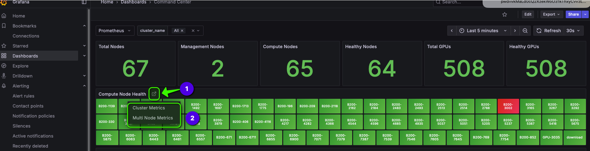

Node Context:
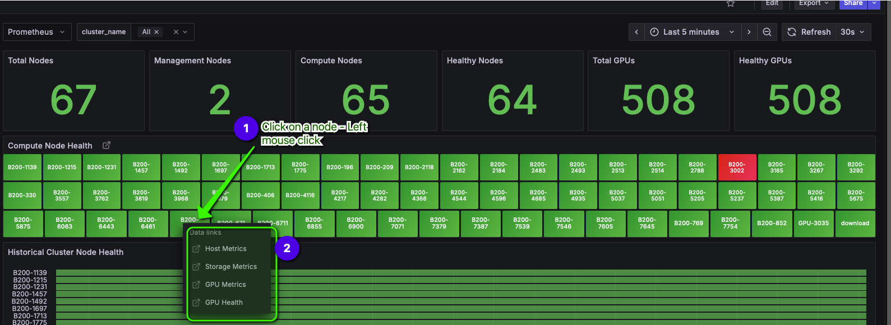

### Alerts

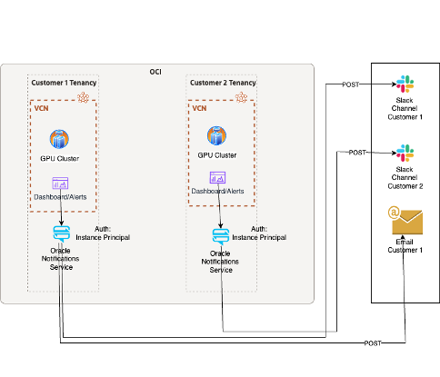

The monitoring stack includes pre-built alerts with pre-configured thresholds based on our experience supporting customer clusters. You can add, modify, or remove alerts as needed.

We include several Prometheus recording rules to calculate health scores for GPU nodes.

See screenshots below.
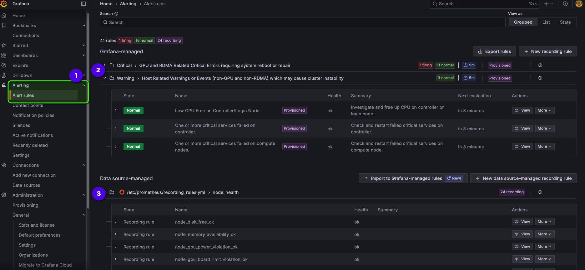

### Subscriptions 

By default, alerts can be delivered to Oracle internal Slack channels. For customer support, we maintain customer-specific Slack channels where engineers provide follow-the-sun monitoring and response.

To set up a subscription for alerts, locate the alert's OCI Notification Service topic as shown below, then click 'Subscriptions' and 'Create Subscription'. See the example below for adding a Slack webhook to a subscription.

Alert Topic:
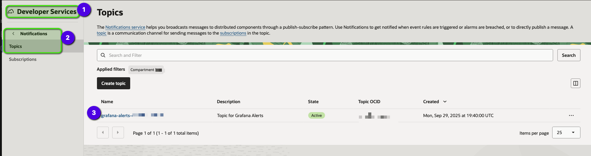

Topic Subscription:
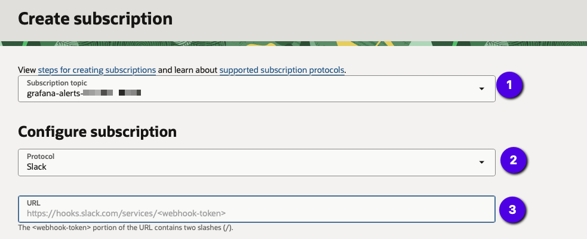

In addition to Slack, we support several other subscription delivery methods:
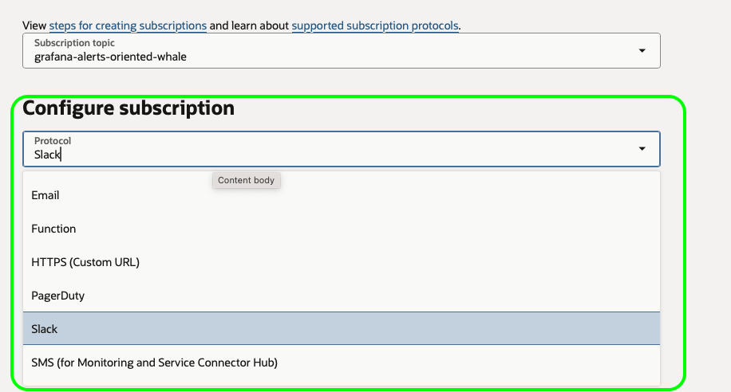


## Operations

### Systemd 

Exporters, Prometheus, and Grafana are all systemd services. You can view their status or start and stop them by running the following commands. You can find the service names in the **Monitoring Configuration** section.

```bash
sudo systemctl status <service-name>
sudo systemctl restart <service-name>
sudo systemctl stop <service-name>

```

### LDAP Validation

Use the following checks when validating Grafana LDAP behavior after deployment or after using the helper scripts on an existing cluster.

| Scenario | Expected result |
| --- | --- |
| Deploy with monitoring enabled, cluster LDAP enabled, and **Enable LDAP for Grafana UI** unchecked | `/etc/grafana/grafana.ini` contains `[auth.ldap] enabled = false`, `/etc/grafana/ldap.toml` is absent, and Grafana continues to use local Grafana users only. |
| Deploy with monitoring enabled, cluster LDAP enabled, and **Enable LDAP for Grafana UI** checked | `/etc/grafana/grafana.ini` contains `[auth.ldap] enabled = true`, `/etc/grafana/ldap.toml` exists as `root:grafana` with mode `0640`, and an LDAP user from the controller can log in to Grafana. |
| Run `scripts/disable_grafana_ldap.py` on an LDAP-enabled Grafana host | `/etc/grafana/ldap.toml` is removed, `[auth.ldap] enabled = false`, local `admin` login still works, and LDAP login is rejected. |
| LDAP-enabled Grafana with existing provisioning | The service account token file `/etc/grafana/.token` remains valid, datasources can still be provisioned, and dashboard updates can still be pushed through the existing service account token flow. |

### Password Management

When Grafana LDAP is enabled, there are still two separate credential paths:

- Local Grafana `admin` remains a Grafana-managed account. Its password is independent of LDAP and can still be changed from the Grafana UI or through Grafana's admin/API flows.
- LDAP-backed Grafana users continue to use the same password as their cluster LDAP account on the controller.

To reset an LDAP user password from the controller:

```bash
sudo cluster user edit <username> -p '<new-password>'
```

If an LDAP user knows their current password and only wants to change it, they can also use the normal `passwd` flow from the controller or another LDAP-backed node.

If an LDAP user clicks Grafana's **Forgot your password?** link, it does not reset the LDAP password. LDAP password changes and resets must happen through the controller LDAP workflow.

### Alert Rules

If you would like to modify alert rules, SSH into the monitoring node. You will find `alert-rules.yaml` and `delete-rules.yaml` in `/etc/grafana/provisioning/alerting`. Modify thresholds in `alert-rules.yaml` as needed. If you do not want to receive an alert, configure it in `delete-rules.yaml`. Do not delete alert rules from `alert-rules.yaml`. Once alert rules are provisioned, Grafana expects CRUD operations to add or delete alerts.

### Recording Rules

Prometheus recording rules can be found in `/etc/prometheus/recording_rules.yml`. You can add or modify recording rules as needed. Do not delete existing recording rules, as many dashboards and alerts depend on them.
